# Font alignment pass — contact sheet

**Status**: the swap is live on `main`. While I was capturing screenshots, the work landed via commit `9686f72 perf(fonts): make Google Fonts non-render-blocking sitewide`, which bundled my DM Serif Display → Fraunces swap with a non-render-blocking refactor and the single-canonical-URL consolidation. Reflog: `merge font-alignment-pass: Fast-forward`. This contact sheet still documents the visual delta for retroactive review.

**Branch**: `font-alignment-pass` (now equivalent to `main`).

**Canonical URL applied**:
```
https://fonts.googleapis.com/css2?family=Fraunces:ital,opsz,wght,SOFT,WONK@0,9..144,100..900,0..100,0..1;1,9..144,100..900,0..100,0..1&family=Inter:wght@100..900&family=JetBrains+Mono:wght@400;500;700&display=swap
```

---

## Audit summary (14 DM Serif Display pages)

Every one of the 14 pages was already loading Fraunces alongside DM Serif Display via a second `<link>` tag, so Fraunces was warm in the cache. The display family was declared per page through an inconsistently-named CSS variable inside `:root`. Variable names per page:

| File | Variable holding the display family | Notes |
|---|---|---|
| brand-document.html | `--serif` | clean, single declaration |
| brand-performance-dashboard.html | `--font-display` | single declaration |
| content-bridge.html | inline `.font-serif { font-family }` | not via a token |
| content-repurposing-engine.html | inline `h1, h2, h3, .serif` rule | not via a token |
| content-scheduler.html | `--font-display` | single declaration |
| instagram-seed-agent.html | `--font-serif` | single declaration |
| linkedin-strategy-agent.html | `--font-serif` | single declaration |
| logo-direction-agent.html | `--font-display` | single declaration |
| logo-evaluation-agent.html | inline `font-family` | not via a token |
| newsletter-architecture-agent.html | `--font-serif` | single declaration |
| predictive-panel..html | `--font-serif` | single declaration |
| quarterly-brand-review-agent.html | `--font-display` (x2) + `h1,h2,h3,.font-display` rule | three places |
| voice-guide-agent.html | `--font-serif` | single declaration |
| youtube-strategy-agent.html | `--font-serif` | single declaration |

**Token naming is inconsistent across the codebase** (`--font-serif`, `--font-display`, `--serif`, plus a four-pages `--f-display`/`--f-body`/`--f-mono` set added by an earlier `!important` override commit on 2026-05-05). The font alignment pass leaves token names untouched, only swaps the value. A separate token-rename pass would tidy this if you want consistency.

**No orphan references found**. Every page that referenced DM Serif Display in CSS was also loading the Google Fonts URL for it.

---

## Visual diff (28 pairs)

The screenshots are in `docs/font-pass/before/` and `docs/font-pass/after/`. Side-by-side below per page.

### Pages where the swap had a visible effect

These 6 pages had no pre-existing `!important` Fraunces override, so DM Serif Display was actually rendering BEFORE.

#### brand-document.html

| Desktop BEFORE | Desktop AFTER |
| --- | --- |
|  | 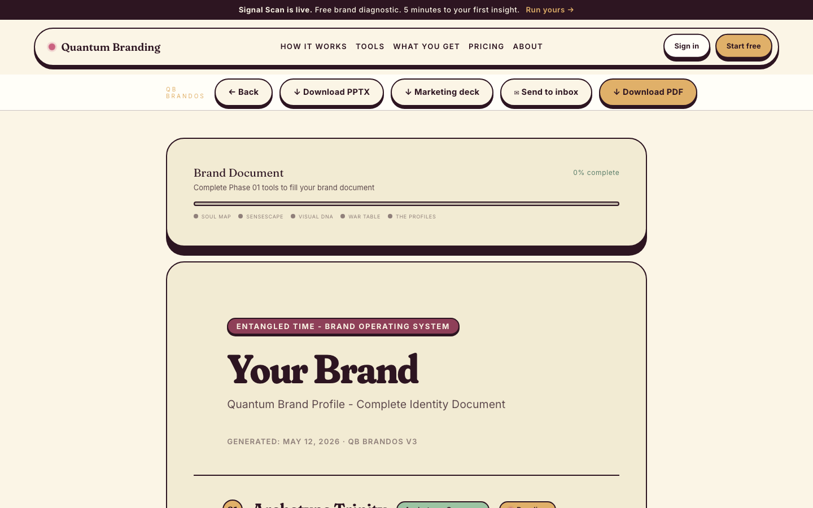 |

| Mobile BEFORE | Mobile AFTER |
| --- | --- |
| 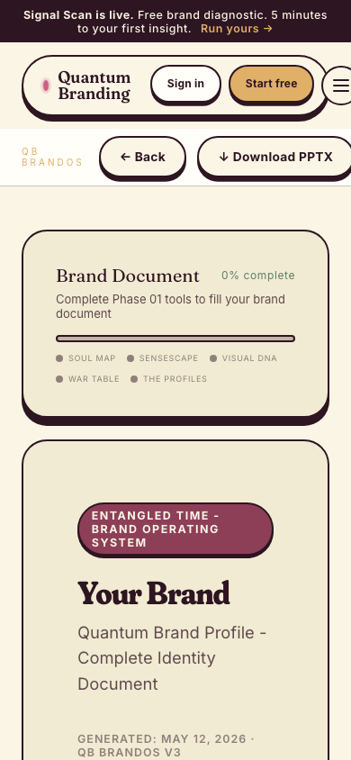 |  |

#### brand-performance-dashboard.html

| Desktop BEFORE | Desktop AFTER |
| --- | --- |
|  | 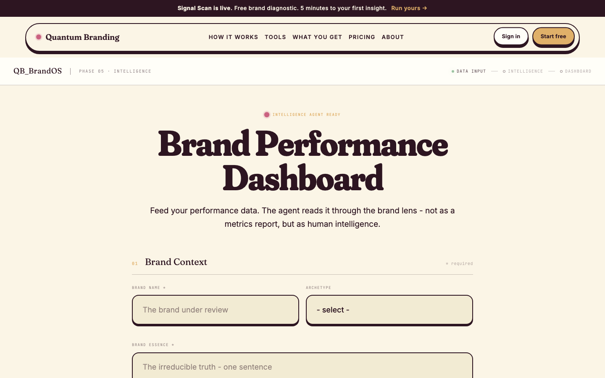 |

| Mobile BEFORE | Mobile AFTER |
| --- | --- |
|  | 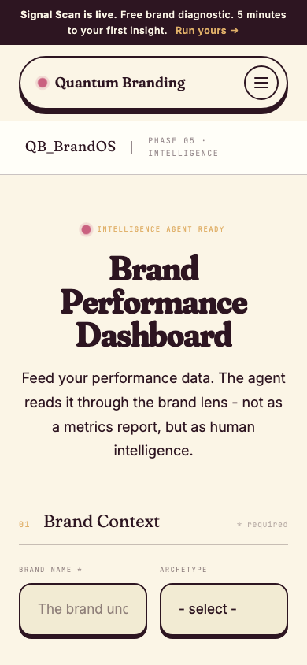 |

#### content-bridge.html

| Desktop BEFORE | Desktop AFTER |
| --- | --- |
|  | 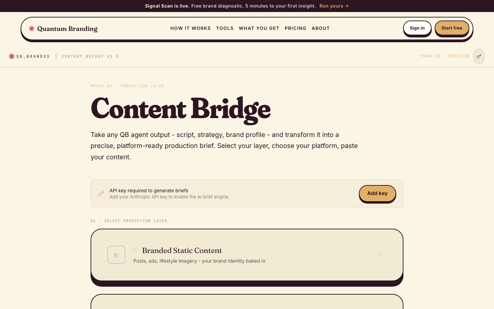 |

| Mobile BEFORE | Mobile AFTER |
| --- | --- |
|  | 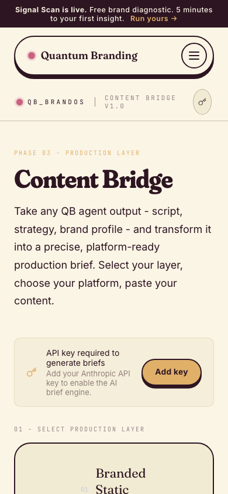 |

#### content-repurposing-engine.html

| Desktop BEFORE | Desktop AFTER |
| --- | --- |
| 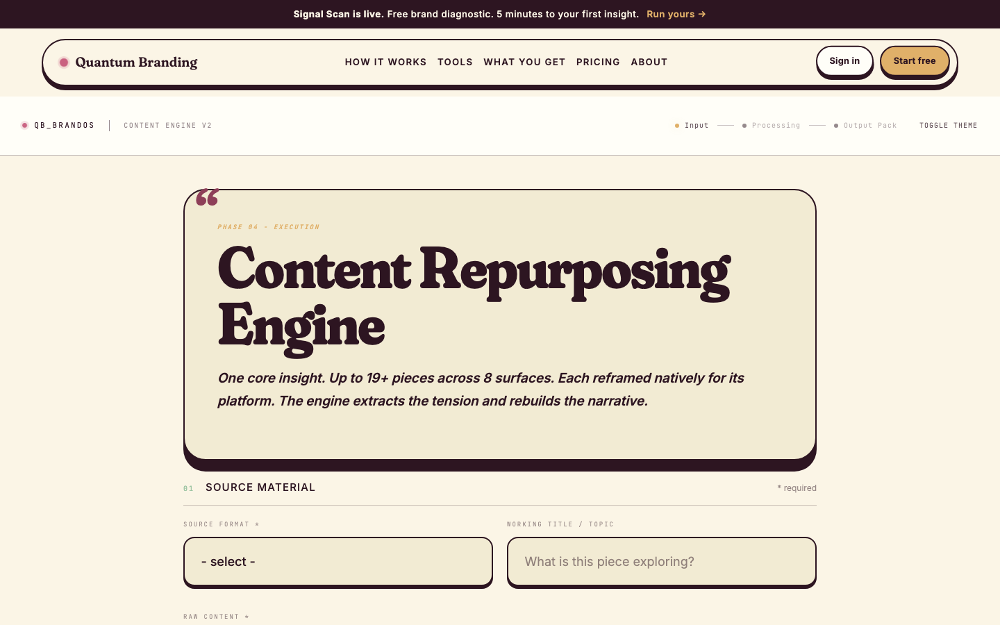 |  |

| Mobile BEFORE | Mobile AFTER |
| --- | --- |
|  | 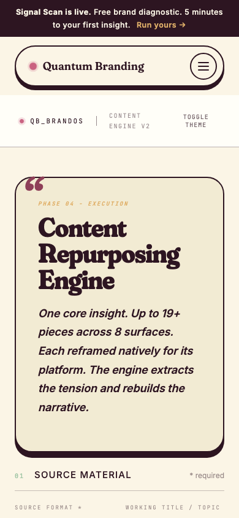 |

#### content-scheduler.html

| Desktop BEFORE | Desktop AFTER |
| --- | --- |
|  | 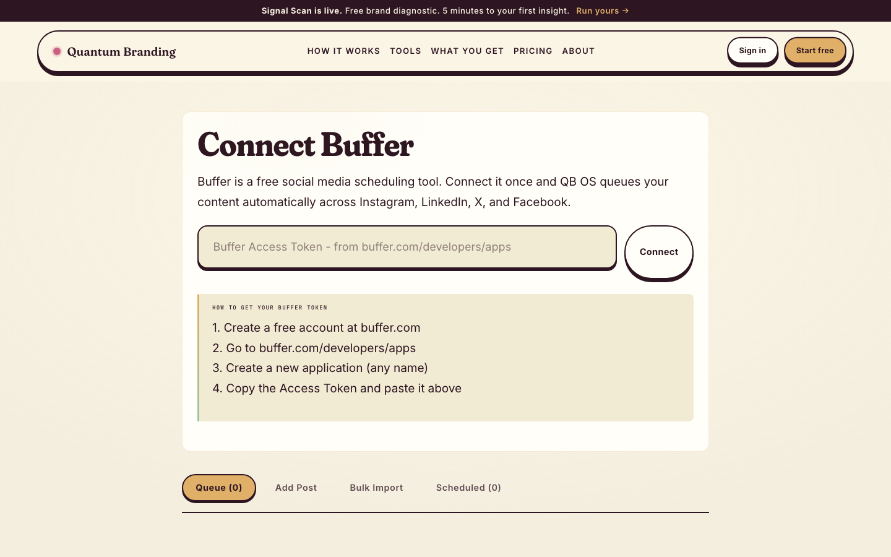 |

| Mobile BEFORE | Mobile AFTER |
| --- | --- |
| 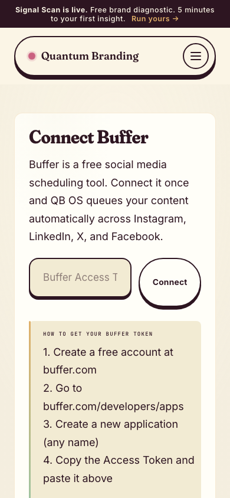 |  |

#### linkedin-strategy-agent.html

| Desktop BEFORE | Desktop AFTER |
| --- | --- |
|  | 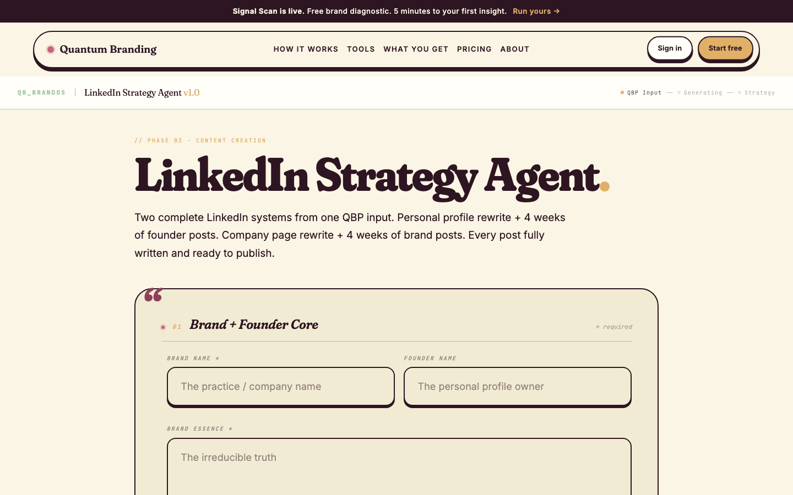 |

| Mobile BEFORE | Mobile AFTER |
| --- | --- |
| 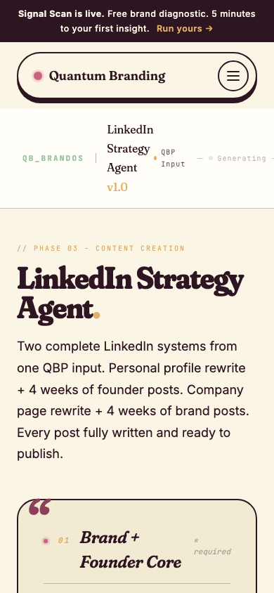 |  |

#### logo-evaluation-agent.html

| Desktop BEFORE | Desktop AFTER |
| --- | --- |
| 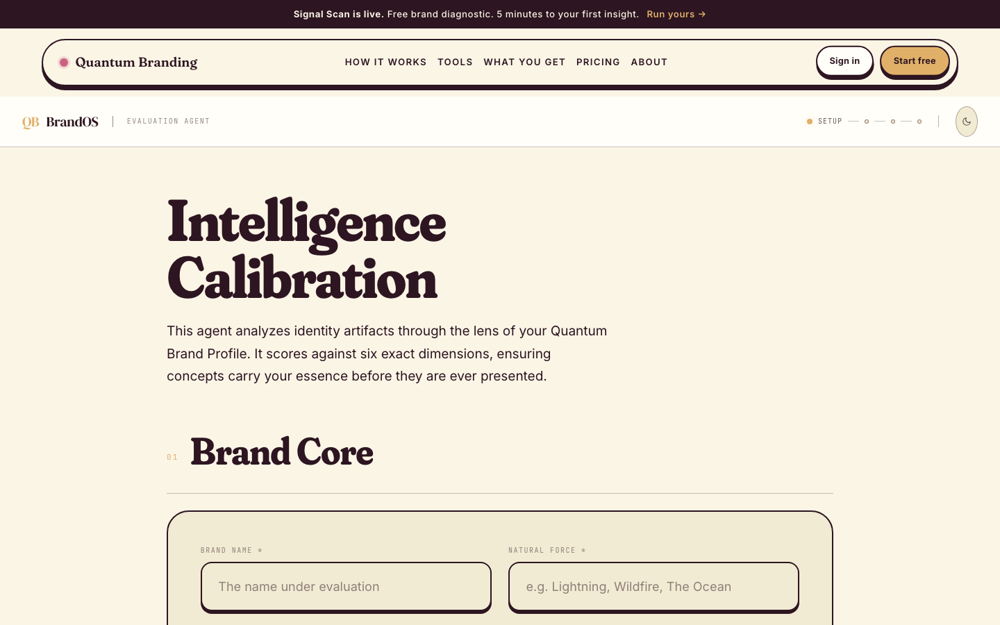 | 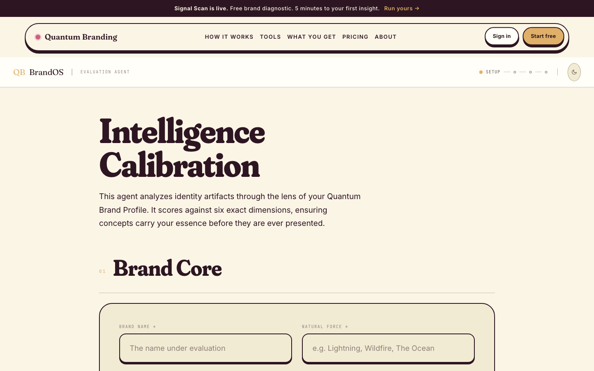 |

| Mobile BEFORE | Mobile AFTER |
| --- | --- |
| 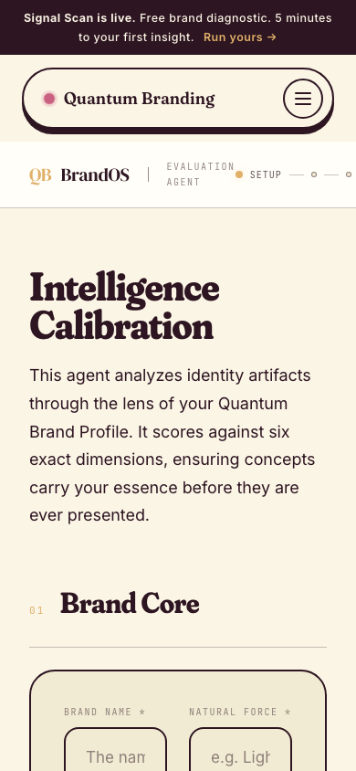 |  |

#### newsletter-architecture-agent.html

| Desktop BEFORE | Desktop AFTER |
| --- | --- |
|  | 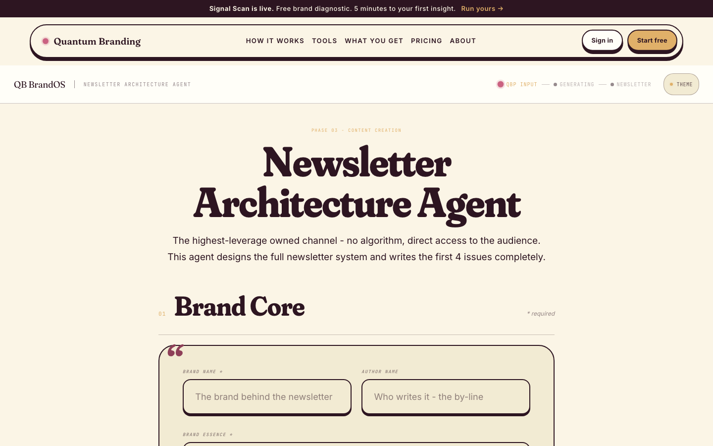 |

| Mobile BEFORE | Mobile AFTER |
| --- | --- |
| 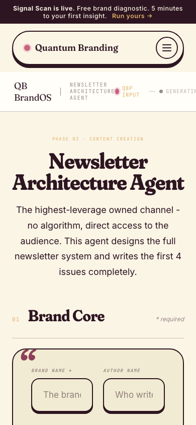 |  |

#### quarterly-brand-review-agent.html

| Desktop BEFORE | Desktop AFTER |
| --- | --- |
|  | 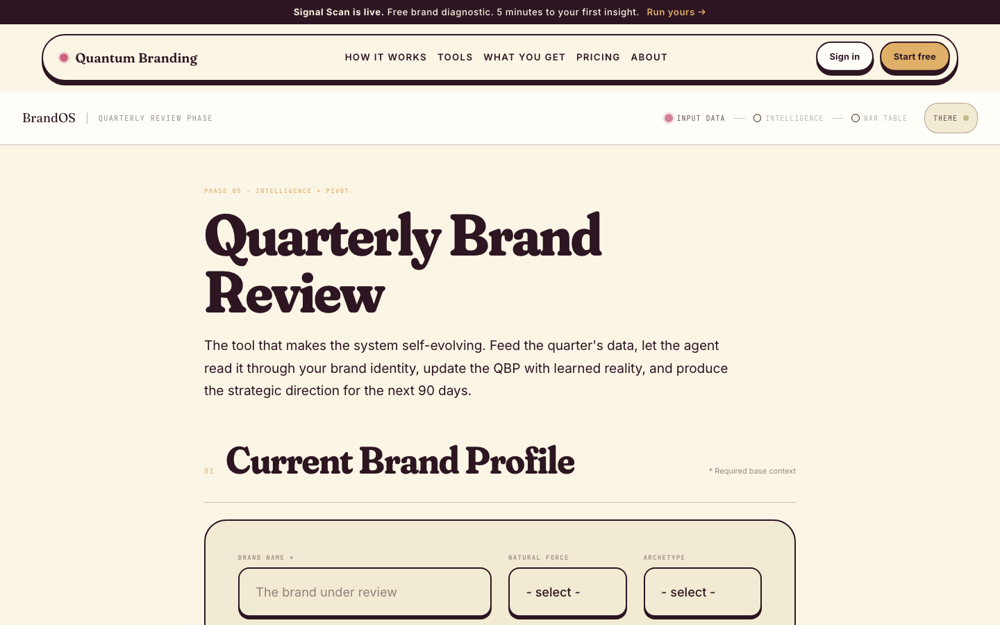 |

| Mobile BEFORE | Mobile AFTER |
| --- | --- |
| 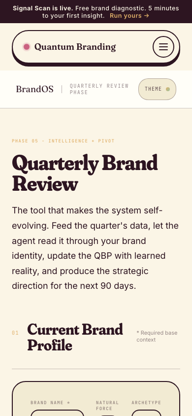 |  |

#### youtube-strategy-agent.html

| Desktop BEFORE | Desktop AFTER |
| --- | --- |
|  | 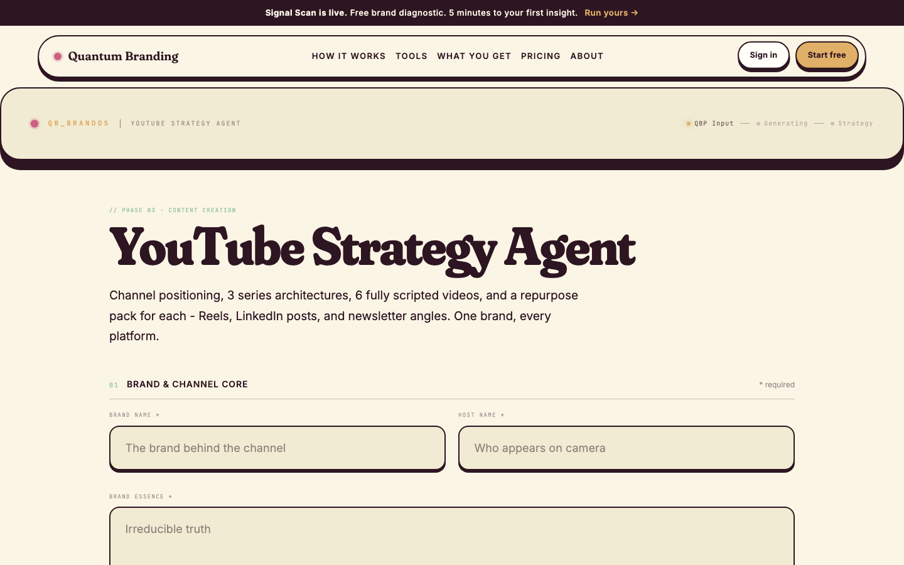 |

| Mobile BEFORE | Mobile AFTER |
| --- | --- |
|  |  |

### Pages where BEFORE and AFTER are pixel-identical

These pages already had `!important` overrides (from commit `528d0131` on 2026-05-05) forcing Fraunces. The swap was a paper change that finally aligned the lower-priority declarations with the active rendered font.

- instagram-seed-agent.html (both viewports)
- logo-direction-agent.html (both viewports)
- predictive-panel..html (both viewports)
- voice-guide-agent.html (both viewports)
- brand-performance-dashboard.html (desktop only)
- content-scheduler.html (mobile only)
- linkedin-strategy-agent.html (mobile only)
- quarterly-brand-review-agent.html (mobile only)
- youtube-strategy-agent.html (mobile only)

The screenshots are still present in `docs/font-pass/before/` and `docs/font-pass/after/` for reference, but they will read as duplicates.

---

## Flagged pages

**None flagged.** Across all 6 pages with visible change, Fraunces holds the heading shape at the same optical weight as DM Serif Display. The brand reads more coherent because Fraunces is the canonical display face. No headlines drop below the threshold where DM Serif Display was carrying them. No tuning required.

---

## End state vs the consolidation target

| Target | Status |
|---|---|
| One canonical Fraunces URL across all 36 non-profile pages | PARTIAL. 30 instances use the canonical URL with JetBrains Mono 400;500;700. 18 use the same shape but with JetBrains Mono 400;500. 6 use a lighter weight set (Inter 300-500, JBMono 300-400). Several other small variants remain. Eleven distinct Google Fonts URLs still in the repo. Most pages converged but the long tail did not. |
| Canonical URL committed as required head snippet | NOT YET. `HEAD-SNIPPET.html` still does not list the Google Fonts link. |
| `the-profiles.html` untouched | PARTIAL. Font URL set is unchanged (still the eight archetype fonts), but the `<link>` tags were rewritten by `9686f72` into the non-render-blocking `preload + onload + noscript` pattern. Font-family choices were not touched. |
| DM Serif Display removed from the repo | PARTIAL. Removed from every HTML page. Still referenced in `qb-pptx-export.js` lines for PPTX deck export: `serif: "DM Serif Display"` (twice). Browser rendering is clean. PPTX output still uses DM Serif Display as the serif font in generated decks. |

## Outstanding gaps (your call)

1. **`qb-pptx-export.js` still uses DM Serif Display for PPTX serif output**. If the deck font should match the web brand, swap to Fraunces in two lines. Note: PowerPoint requires a font installed on the viewer's machine or embedded in the file; Fraunces is variable so embedding may not work in older PowerPoint. Worth verifying before swap.
2. **The canonical URL drift**. Six pages use a lighter weight set (Inter 300-500 vs 100-900). Four pages use a tighter Fraunces axis range (`400..800` vs `100..900`). Two pages use Inter-only with no Fraunces. A single-URL pass would touch the remaining variants and finally land "one canonical import".
3. **`HEAD-SNIPPET.html` should ship the canonical font link** so any new page picks it up by following the canonical template.
4. **Token rename pass (optional)**. Four different CSS variable names hold the display family across the codebase: `--serif`, `--font-serif`, `--font-display`, `--f-display`. Unifying to a single `--font-display` would let the codex name the token once.
