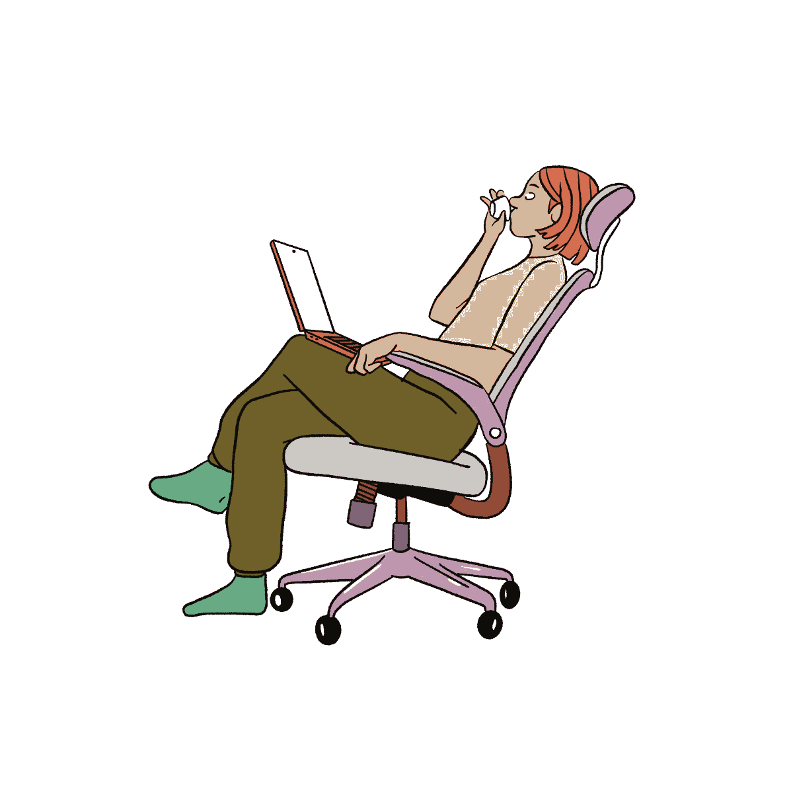

# QB BrandOS Design System v3.3
## Pomegranate-derived. Cream palette. Editorial illustrations. Animated media. $0 budget.
### Drop-in for Claude Code. Synced with QB Thinking Machine Master Instruction v4 (April 2026).

This document is the single source of truth for visual, motion, and interaction design across QB BrandOS. It supersedes v3, v3.1, v3.2 and the design summary block in Part 5 of the QB Thinking Machine Master Instruction. Every HTML file in the QB BrandOS repo is to be rebuilt against these tokens, primitives, and patterns.

**What's new in v3.3:**
- Part 20 — Pomegranate UI/UX & Interaction Patterns (full chapter on the conversion-grade interaction language pomegranate.health uses, infused into QB).
- Synced agent count to 20, phase count to 6.
- Illustration library inventory locked (Part 17 cross-references the Master Instruction v4 Part 6).

**What's locked from v3.2:** system architecture (cream + ink, two-layer 3D pill, hard offset shadow, fluid clamp scales, 32px cards, eyebrow-tag-then-headline structure). Typography (Fraunces variable display + Inter body + JetBrains Mono). Palette (cream + aubergine ink + warm gold CTA + dusty pastel triad). Phase color mapping. Illustration system (New Yorker editorial direction). Motion vocabulary.

**What's deprecated (do not use):** dark backgrounds as default, glass card treatment, EB Garamond, Figtree, DM Serif Display, Romain Blais character library, the Character Machine v3 pipeline, browser localStorage as the only persistence layer (Supabase is now the eventual target), abstract-shape-only illustrations.

**What's free:** every typeface, every color value, every dependency. $0 budget enforced.

---

## Part 1 — The Six Signatures

If Claude Code can only ship six things, ship these. Lose one and the system collapses.

1. **Cream #FBF5E6 page background, ink #2D1521 body text and 2px borders.** Warm buttercream against deep aubergine. No gray middle ground. No dark mode default.
2. **The 3D two-layer pill button.** Solid ink slab translated 0.17em down behind, content layer translated 0.17em up on top. Hover lifts the top to -0.35em. Press drops it to +0.28em. 0.4s `cubic-bezier(0.19, 1, 0.22, 1)` on every transition.
3. **Hard solid offset shadow on cards, hero illustrations, and phone mockups.** `box-shadow: 0 9px #2D1521` mobile, `0 16px #2D1521` at 640px and up. No blur, full opacity. Sticker-stamped tactile feel.
4. **Eyebrow tag then headline structure.** Every section opens with a small uppercase pill tag in cream with ink border, followed by a Fraunces headline. Tag does the emotional read, headline does the credentialed read.
5. **Fluid clamp type and space.** Nothing is a fixed pixel. Type ranges step--2 through step-7, space ranges 3xs through 3xl, all interpolating 320px to 1920px viewport.
6. **New Yorker editorial illustrations inside cream cards.** Bold ink outlines, flat color fills, character-forward composition. The illustrations carry their own richer palette and sit inside the cream card frame with the hard offset shadow.

---

## Part 2 — Color Tokens

### 2.1 Core neutrals

```
--cream:          #FBF5E6   /* page bg, scrollbar track, soft tag bg */
--cream-card:     #F2EBD3   /* card surface, accordion header, box-button bg, input bg */
--cream-warm:     #ECDDB8   /* scrollbar thumb, dropdown-item checked, gradient stop */
--cream-edge:     #DBD4C0   /* subtle borders on box and seamless buttons */
--cream-rose:     #F4D9DD   /* box button hover, dropdown-item hover */
--white:          #FFFEF8   /* raised popover bg, accordion body bg */
```

### 2.2 QB ink

```
--ink:            #2D1521   /* body text, 2px borders, button slab, illustration outlines, scroll fade */
--ink-75:         rgba(45, 21, 33, 0.75)
--ink-50:         rgba(45, 21, 33, 0.50)
--ink-33:         rgba(45, 21, 33, 0.33)
--ink-25:         rgba(45, 21, 33, 0.25)
```

Deep aubergine. 13:1 contrast against cream (AAA pass). Same color also serves as the bold outline color for New Yorker illustrations (see Part 17).

### 2.3 QB Triad (system roles)

```
--gold:           #E0B069   /* primary CTA bg, focus-hover ring, switch-on, list bullet */
--rose:           #CA6180   /* brand mark, decorative rules, eyebrow tag accent */
--teal:           #9ED3DC   /* pulse: focus ring, selection bg, app-loading bar, switch handle */
```

Gold = "this is the primary action" (6.6:1 against ink, AAA).
Rose = brand mark, decorative only, never as button fill.
Teal = system pulse: focus, selection, loading.

### 2.4 Secondary and depth

```
--rose-deep:      #8E3F58   /* secondary CTA bg, dark card gradient end, dark-tag */
--teal-deep:      #5BA8B5   /* active button state bg, deep accent */
--gold-deep:      #B58840   /* selected state on gold, premium tier accent */
--aubergine:      #4A2B3A   /* deep rich accent */
```

### 2.5 Decoration accents

```
--pink:           #FCB7C7   /* decorative, illustration fills, Phase 03 identity */
--butter:         #FEFD99   /* decorative, illustration fills, butter tag bg */
--teal-soft:      #C5E5E9   /* decorative, illustration fills */
--rose-soft:      #ECC4D0   /* decorative, illustration fills */
```

Decoration accents are paint, never text or border colors. They appear inside illustrations, in tag fills, and in subtle gradient stops. They never carry semantic meaning.

### 2.6 Phase colors (six-phase architecture)

```
--phase-acquisition:    #C5E5E9   /* Phase 00: Signal Scan, lead capture */
--phase-discovery:      #9CC4A2   /* Phase 01: Brand Soul Map, Sensescape, Visual DNA, War Table */
--phase-creation:       #B5C8E5   /* Phase 02: Logo Direction, Logo Evaluation, Voice Guide */
--phase-content:        #FCB7C7   /* Phase 03: Instagram, LinkedIn, YouTube, Newsletter, Content Bridge */
--phase-execution:      #E89380   /* Phase 04: Repurposing Engine, Content Scheduler */
--phase-intelligence:   #B080A0   /* Phase 05: Dashboard, Quarterly Review, Predictive Panel */
```

Every phase has one color. The color appears as the dot in eyebrow tags ("Phase 02 · Brand Creation"), as the accent on phase-specific cards, and as the fill on phase progress indicators in the QBP. The colors never replace gold/rose/teal in their system roles.

### 2.7 Illustration palette (locked)

```
forest:           #5B7E6A
peach:            #E89380
coral:            #DC6B52
mustard:          #D4B85A
rust:             #B8704D
lavender:         #B8A0C7
pink-soft:        #F4C4D0
```

The illustration palette is fixed. Editorial drawings use these seven fills with --ink outlines. See Part 17.

### 2.8 System utilities

```
--scrim:          rgba(251, 245, 230, 0.90)   /* modal scrim, image fade overlay */
--skeleton:       rgba(224, 176, 105, 0.33)   /* loading skeleton bg */
```

---

## Part 3 — Typography

### 3.1 Stack

```
--font-display:   'Fraunces', ui-serif, Georgia, 'Times New Roman', serif;
--font-body:      'Inter', ui-sans-serif, system-ui, -apple-system, BlinkMacSystemFont, sans-serif;
--font-mono:      'JetBrains Mono', ui-monospace, 'SF Mono', Menlo, monospace;
```

All three families are free under SIL Open Font License (Fraunces, Inter) and OFL (JetBrains Mono).

### 3.2 Fraunces (display)

Variable font with optical size, weight, italic, SOFT (softness), WONK axes. Loaded via Google Fonts. The QB headline voice uses:
- `opsz` 9-144 — headline pieces use opsz 60-80 for storybook character
- `wght` 100-900 — headlines at 600, italic spotlight phrases at 600
- `SOFT` 50-70 — set high for that storybook feel
- `WONK` 0 or 1 — wonk on for a subtle handwritten character on key italic words

Use Fraunces for: H1, H2, H3, hero italic spotlight phrases, founder block name, pricing tier names.

Never use Fraunces for: body copy, button labels, navigation, mono caps tags, system text.

### 3.3 Inter (body and UI)

Variable font, weights 100-900. Used at:
- 500 (regular) for body
- 600 (bold) for emphasis inside body, button labels
- 700 (button bold) for primary CTA text

Letter-spacing on Inter: -0.01em on body, -0.02em on large display sizes.

### 3.4 JetBrains Mono (system)

Used at:
- 400 (regular) for code blocks, technical labels
- 500 (medium) for mono caps eyebrows, stat labels, system tags

Always letter-spaced 0.08em to 0.16em when used as caps. Always uppercased in CSS, not in markup.

### 3.5 Type scale (fluid clamp)

```
--step--2:   clamp(0.7813rem, 0.7546rem + 0.1254vw, 0.88rem);
--step--1:   clamp(0.9375rem, 0.8937rem + 0.2063vw, 1.1rem);
--step-0:    clamp(1.125rem, 1.0575rem + 0.3175vw, 1.375rem);
--step-1:    clamp(1.35rem, 1.2505rem + 0.4683vw, 1.7188rem);
--step-2:    clamp(1.62rem, 1.4773rem + 0.6714vw, 2.1488rem);
--step-3:    clamp(1.9438rem, 1.7436rem + 0.9421vw, 2.6856rem);
--step-4:    clamp(2.3325rem, 2.0561rem + 1.3008vw, 3.3569rem);
--step-5:    clamp(2.7994rem, 2.4224rem + 1.7738vw, 4.1963rem);
--step-6:    clamp(3.3594rem, 2.8506rem + 2.3944vw, 5.245rem);
--step-7:    clamp(4.0313rem, 3.3499rem + 3.2063vw, 6.5563rem);
```

Type scale interpolates between 320px and 1920px viewports. step-0 is the body baseline (~18-22px). step-7 is the hero size (~64-105px).

### 3.6 Typography classes

```css
.qb-type-heading {
  font-family: var(--font-display);
  font-size: var(--step-5);
  font-weight: 600;
  font-variation-settings: 'opsz' 60, 'SOFT' 50, 'WONK' 0;
  line-height: 1.05;
  letter-spacing: -0.02em;
  color: var(--ink);
}
.qb-type-heading em {
  font-style: italic;
  font-variation-settings: 'opsz' 80, 'SOFT' 60, 'WONK' 1;
  color: var(--gold);
}

.qb-type-subheading {
  font-family: var(--font-display);
  font-size: var(--step-3);
  font-weight: 600;
  font-variation-settings: 'opsz' 50, 'SOFT' 50;
  line-height: 1.1;
  letter-spacing: -0.015em;
  color: var(--ink);
}

.qb-type-opening {
  font-family: var(--font-body);
  font-size: var(--step-1);
  font-weight: 500;
  line-height: 1.5;
  letter-spacing: -0.01em;
  color: var(--ink);
}
.qb-type-opening strong { font-weight: 700; }

.qb-type-text {
  font-family: var(--font-body);
  font-size: var(--step-0);
  font-weight: 500;
  line-height: 1.6;
  color: var(--ink);
}

.qb-type-subtext {
  font-family: var(--font-body);
  font-size: var(--step--1);
  font-weight: 500;
  line-height: 1.5;
  color: var(--ink-75);
}

.qb-type-mono-caps {
  font-family: var(--font-mono);
  font-size: var(--step--2);
  font-weight: 500;
  letter-spacing: 0.12em;
  text-transform: uppercase;
  color: var(--ink-75);
}

.qb-type-balance { text-wrap: balance; }
.qb-type-pretty  { text-wrap: pretty; }
.qb-type-center  { text-align: center; }
.qb-type-spot-1  { color: var(--gold); font-style: italic; }
.qb-type-spot-2  { color: var(--rose-deep); font-style: italic; }
```

### 3.7 Text wrap discipline

`text-wrap: balance` on every headline (qb-type-balance class). `text-wrap: pretty` on every body paragraph (qb-type-pretty class). These two prevent ragged-right widow lines and orphaned single words on the last line. Non-negotiable.

---

## Part 4 — Spacing scale

```
--space-3xs:        clamp(0.5625rem, 0.5288rem + 0.1587vw, 0.6875rem);
--space-2xs:        clamp(0.5625rem, 0.5288rem + 0.1587vw, 0.6875rem);
--space-xs:         clamp(0.875rem,  0.8244rem + 0.2381vw, 1.0625rem);
--space-s:          clamp(1.125rem,  1.0575rem + 0.3175vw, 1.375rem);
--space-m:          clamp(1.6875rem, 1.5863rem + 0.4762vw, 2.0625rem);
--space-l:          clamp(2.25rem,   2.1151rem + 0.6349vw, 2.75rem);
--space-xl:         clamp(3.375rem,  3.1726rem + 0.9524vw, 4.125rem);
--space-2xl:        clamp(4.5rem,    4.2302rem + 1.2698vw, 5.5rem);
--space-3xl:        clamp(6.75rem,   6.3452rem + 1.9048vw, 8.25rem);

/* Pair tokens for between-element gaps */
--space-3xs-2xs:    clamp(0.5625rem, 0.5288rem + 0.1587vw, 0.6875rem);
--space-xs-s:       clamp(0.875rem,  0.7401rem + 0.6349vw, 1.375rem);
--space-s-m:        clamp(1.125rem,  0.872rem  + 1.1905vw, 2.0625rem);
--space-m-l:        clamp(1.6875rem, 1.4008rem + 1.3492vw, 2.75rem);
--space-l-xl:       clamp(2.25rem,   1.744rem  + 2.381vw,  4.125rem);
--space-xl-2xl:     clamp(3.375rem,  2.8016rem + 2.6984vw, 5.5rem);
--space-2xl-3xl:    clamp(4.5rem,    3.4881rem + 4.7619vw, 8.25rem);
```

Section padding-block defaults: `var(--space-3xl) 0` for major sections. `var(--space-xl) 0` for tight sections. Inner card padding: `var(--space-l)` on mobile, `var(--space-xl)` from 768px up.

---

## Part 5 — Layout

### 5.1 Containers

```css
.qb-x         { max-width: 1240px; margin-inline: auto; padding-inline: var(--space-m); }
.qb-x-narrow  { max-width: 780px;  margin-inline: auto; padding-inline: var(--space-m); }
.qb-x-wide    { max-width: 1480px; margin-inline: auto; padding-inline: var(--space-m); }
```

### 5.2 Section base

```css
.section {
  padding-block: var(--space-3xl);
  background: var(--cream);
  position: relative;
}
.section.is-tight     { padding-block: var(--space-xl); }
.section.is-dark      { background: var(--ink); color: var(--cream); }
.section.is-cream-warm{ background: var(--cream-warm); }
.section.is-cream-card{ background: var(--cream-card); }
```

Dark sections invert the contrast: cream text on ink background. Used for centerpiece blocks (the dark green hero demonstration on index, the founder block, the testimonials, the personas section). Never default to dark.

### 5.3 Section header pattern

```html
<header class="section_header">
  <span class="qb-tag is-soft"><span class="qb-tag_content">Eyebrow text</span></span>
  <h2 class="qb-type-heading qb-type-balance reveal">Headline copy. <em>Italic spotlight.</em></h2>
  <p class="qb-type-opening qb-type-pretty reveal rd1">Optional subhead paragraph.</p>
</header>
```

```css
.section_header {
  display: flex; flex-direction: column; align-items: center;
  gap: var(--space-s); text-align: center;
  max-width: 720px; margin: 0 auto var(--space-xl);
}
```

The eyebrow tag, headline, optional subhead pattern is applied to every major section without exception. It is the rhythm of the system.

---

## Part 6 — Borders and radii

```
--radius-pill:    9999px       /* buttons, tags, pills */
--radius-card:    32px          /* major cards, sections, hero illustrations */
--radius-card-sm: 24px          /* raised popovers, inner cards, smaller illustrations */
--radius-box:     8px           /* inputs, code blocks, mock UI elements */
--radius-circle:  50%           /* avatars, dots, decorative circles */

--border-w:       2px           /* default border weight on cards, buttons, inputs */
--border-w-bubble:1.5px         /* chat bubbles, lighter inset elements */
```

Borders are always solid `var(--ink)` unless explicitly stated. Card borders are 2px ink. Chat bubble borders are 1.5px ink. Input borders are 2px ink, ink-50 on disabled.

---

## Part 7 — Shadows

```
--shadow-card-mobile:  0 9px var(--ink)
--shadow-card-desktop: 0 16px var(--ink)
--shadow-card-deep:    0 22px var(--ink)   /* hover state on interactive cards */
--shadow-button-base:  inset 0 -0.17em 0 var(--ink)  /* button slab */
```

The shadow is hard offset, no blur, full opacity, --ink color. This is signature 3 and the visual signature most likely to be lost in regression. If a card looks soft or "modern web app," the shadow is wrong.

```css
.qb-card-shadow {
  box-shadow: var(--shadow-card-mobile);
}
@media (min-width: 640px) {
  .qb-card-shadow { box-shadow: var(--shadow-card-desktop); }
}
.qb-card-shadow.is-interactive:hover {
  box-shadow: var(--shadow-card-deep);
  transform: translateY(-6px);
}
```

---

## Part 8 — Focus, selection, scrollbar

### 8.1 Focus

Focus is a 3px teal ring with 2px offset, always visible on keyboard navigation:

```css
:focus-visible {
  outline: 3px solid var(--teal);
  outline-offset: 2px;
  border-radius: 4px;
}
.qb-button:focus-visible { outline-offset: 4px; }
```

### 8.2 Selection

Text selection uses teal at 33% opacity with ink text:

```css
::selection { background: rgba(158, 211, 220, 0.33); color: var(--ink); }
```

### 8.3 Scrollbar

Custom scrollbars on the body to maintain the cream system. WebKit and Firefox both:

```css
:root {
  --qb-scrollbar-w: 10px;
  --qb-scrollbar-r: 20px;
}
html { scrollbar-width: thin; scrollbar-color: var(--cream-warm) var(--cream); }
::-webkit-scrollbar { width: var(--qb-scrollbar-w); height: var(--qb-scrollbar-w); }
::-webkit-scrollbar-track { background: var(--cream); }
::-webkit-scrollbar-thumb { background: var(--cream-warm); border-radius: var(--qb-scrollbar-r); border: 2px solid var(--cream); }
::-webkit-scrollbar-thumb:hover { background: var(--ink-25); }
```

---

## Part 9 — Components

### 9.1 The two-layer 3D pill button

```html
<a href="#" class="qb-button is-primary">
  <span class="qb-button_content">Start free</span>
</a>
```

```css
.qb-button {
  --bg: var(--cream-card);
  --fg: var(--ink);
  --slab: var(--ink);
  position: relative; display: inline-flex; align-items: center; justify-content: center;
  font-family: var(--font-body); font-weight: 700; font-size: var(--step-0);
  letter-spacing: -0.005em;
  padding: 0.95em 1.55em;
  background: var(--slab);
  color: var(--fg);
  border-radius: var(--radius-pill);
  text-decoration: none;
  cursor: pointer;
  user-select: none;
  transition: transform 0.4s var(--ease-qb);
}
.qb-button_content {
  display: inline-flex; align-items: center; justify-content: center; gap: 0.4em;
  width: 100%; height: 100%;
  padding: 0.95em 1.55em;
  margin: -0.95em -1.55em;
  background: var(--bg);
  color: var(--fg);
  border-radius: inherit;
  border: 2px solid var(--slab);
  transform: translateY(-0.17em);
  transition: transform 0.4s var(--ease-qb);
}
.qb-button:hover .qb-button_content { transform: translateY(-0.35em); }
.qb-button:active .qb-button_content { transform: translateY(0.28em); }
.qb-button.is-primary   { --bg: var(--gold); --fg: var(--ink); }
.qb-button.is-secondary { --bg: var(--rose-deep); --fg: var(--cream); }
.qb-button.is-active    { --bg: var(--teal-deep); --fg: var(--cream); }
.qb-button.is-lg        { font-size: var(--step-1); }
.qb-button.is-sm        { font-size: var(--step--1); }
.qb-button.is-expand    { width: 100%; }
.qb-button.on-dark      { --slab: var(--cream); }
.qb-button.on-dark.is-primary { --bg: var(--gold); --fg: var(--ink); }
```

The two layers move at slightly different rates on hover and press. This is signature 2. Lose the offset and the system collapses.

### 9.2 Eyebrow tag

```html
<span class="qb-tag is-soft"><span class="qb-tag_content">From the founder</span></span>
```

```css
.qb-tag {
  display: inline-flex; padding: 1px;
  background: var(--ink); border-radius: var(--radius-pill);
}
.qb-tag_content {
  display: inline-flex; align-items: center; gap: 0.5em;
  padding: 0.35em 0.9em;
  background: var(--cream-card);
  color: var(--ink);
  font-family: var(--font-mono); font-size: var(--step--2); font-weight: 500;
  letter-spacing: 0.12em; text-transform: uppercase;
  border-radius: inherit;
}
.qb-tag::before {
  content: ''; width: 6px; height: 6px; border-radius: 50%;
  background: var(--rose);
  margin: 0 0.4em 0 0.7em;
  align-self: center;
}
.qb-tag.is-rose .qb-tag_content   { background: var(--cream-rose); }
.qb-tag.is-teal .qb-tag_content   { background: var(--teal-soft); }
.qb-tag.is-pink .qb-tag_content   { background: var(--pink); }
.qb-tag.is-butter .qb-tag_content { background: var(--butter); }
.qb-tag.is-soft .qb-tag_content   { background: var(--cream); }
.qb-tag.on-dark                   { background: var(--cream); }
.qb-tag.on-dark .qb-tag_content   { background: var(--ink); color: var(--cream); }
```

The dot before the tag content is the brand mark. It is always rose. Phase tags swap the dot color to the phase token (Phase 02 tag has periwinkle dot, Phase 04 has peach dot, etc.).

### 9.3 Card

```html
<article class="qb-card qb-card-shadow is-interactive">
  <span class="qb-tag"><span class="qb-tag_content">Phase 01 · Discovery</span></span>
  <h3 class="qb-type-subheading">Card title</h3>
  <p class="qb-type-text">Card body copy in Inter.</p>
</article>
```

```css
.qb-card {
  background: var(--cream-card);
  border: var(--border-w) solid var(--ink);
  border-radius: var(--radius-card);
  padding: var(--space-l);
  display: flex; flex-direction: column; gap: var(--space-s);
}
@media (min-width: 768px) { .qb-card { padding: var(--space-xl); } }
.qb-card.is-raised        { background: var(--white); border-radius: var(--radius-card-sm); }
.qb-card.is-warm          { background: var(--cream-warm); }
.qb-card.is-rose          { background: var(--cream-rose); }
.qb-card.is-on-dark       { background: var(--aubergine); border-color: var(--cream); color: var(--cream); }
```

### 9.4 Input field

```html
<label class="qb-field">
  <span class="qb-field_label">Brand name</span>
  <input type="text" class="qb-field_input" placeholder="What do you call this brand?">
</label>
```

```css
.qb-field { display: flex; flex-direction: column; gap: var(--space-2xs); }
.qb-field_label {
  font-family: var(--font-mono); font-size: var(--step--2); font-weight: 500;
  letter-spacing: 0.12em; text-transform: uppercase; color: var(--ink-75);
}
.qb-field_input {
  font-family: var(--font-body); font-size: var(--step-0); font-weight: 500;
  padding: 0.8em 1em;
  background: var(--cream-card);
  color: var(--ink);
  border: var(--border-w) solid var(--ink);
  border-radius: var(--radius-box);
  transition: border-color 0.15s var(--ease-standard), background 0.15s var(--ease-standard);
}
.qb-field_input:focus { background: var(--white); }
.qb-field_input::placeholder { color: var(--ink-50); }
```

### 9.5 Switch (toggle)

```html
<button class="qb-switch" data-state="off" type="button">
  <span class="qb-switch_handle"></span>
</button>
```

```css
.qb-switch {
  width: 56px; height: 32px;
  background: var(--cream-card);
  border: 2px solid var(--ink);
  border-radius: 9999px;
  position: relative;
  cursor: pointer;
  transition: background 0.3s var(--ease-qb);
}
.qb-switch_handle {
  position: absolute; top: 3px; left: 3px;
  width: 22px; height: 22px;
  background: var(--teal);
  border: 2px solid var(--ink);
  border-radius: 50%;
  transition: transform 0.3s var(--ease-qb), background 0.3s var(--ease-qb);
}
.qb-switch[data-state="on"] { background: var(--gold); }
.qb-switch[data-state="on"] .qb-switch_handle { transform: translateX(24px); background: var(--white); }
```

### 9.6 Chat bubble (dialogue mockups)

```html
<div class="qb-bubble is-user"><p>Sample user message.</p></div>
<div class="qb-bubble is-ai"><p>Sample AI response.</p></div>
```

```css
.qb-bubble {
  max-width: 85%;
  padding: 0.7em 1em;
  border: 1.5px solid var(--ink);
  border-radius: 18px;
  font-family: var(--font-body); font-size: var(--step--1); line-height: 1.5;
}
.qb-bubble.is-user {
  background: var(--gold); color: var(--ink);
  margin-left: auto; border-bottom-right-radius: 4px;
}
.qb-bubble.is-ai {
  background: var(--cream-card); color: var(--ink);
  border-bottom-left-radius: 4px;
}
```

---

## Part 10 — Motion (system-level)

### 10.1 Easings

```
--ease-standard:  cubic-bezier(0.4, 0, 0.2, 1)              0.15s  /* utilitarian state changes */
--ease-qb:        cubic-bezier(0.19, 1, 0.22, 1)            0.4s   /* signature button + reveal */
--ease-spring:    cubic-bezier(0.175, 0.885, 0.32, 1.275)   0.5s   /* page enter, spring effects */
--ease-sharp:     cubic-bezier(0.55, 0.085, 0.68, 0.53)     0.1s   /* exits, fades */
--ease-glow:      cubic-bezier(0.455, 0.03, 0.515, 0.955)   2.4s alternate  /* breathing pulses */
```

### 10.2 Keyframes (system-level)

```css
@keyframes qb-spin       { from { transform: rotate(0); } to { transform: rotate(360deg); } }
@keyframes qb-glow       { from { opacity: 0.33; } to { opacity: 1; } }
@keyframes qb-loading-bar{ 0%,100% { transform: translateX(-100%); } 99.99% { transform: translateX(100%); } }
@keyframes qb-fade-out   { 0%,50% { opacity: 1; } to { opacity: 0; } }
@keyframes qb-rise-in    { from { opacity: 0; transform: translateY(20px); } to { opacity: 1; transform: translateY(0); } }
@keyframes qb-float      { 0%,100% { transform: translate(0,0); } 50% { transform: translate(var(--fx, 6px), var(--fy, -6px)); } }
```

### 10.3 Page transitions

```css
.qb-page             { transform-origin: 50% 50vh; }
.qb-page-enter-active{ animation: qb-page-in 0.5s cubic-bezier(0.175, 0.885, 0.32, 1.275) 0.1s both; }
.qb-page-leave-active{ animation: qb-page-out 0.15s ease both; }
@keyframes qb-page-in  { from { opacity: 0; transform: scale(0.93); } to { opacity: 1; transform: scale(1); } }
@keyframes qb-page-out { from { opacity: 1; } to { opacity: 0; } }
```

### 10.4 App-loading bar

```html
<div class="qb-loading-bar" data-state="loading"></div>
```

```css
.qb-loading-bar {
  position: fixed; top: 0; left: 0; right: 0; height: 4px; z-index: 100; pointer-events: none;
  background: linear-gradient(to right, rgba(158,211,220,0) 0%, var(--teal) 50%, rgba(158,211,220,0) 100%);
  animation: qb-loading-bar 1s linear infinite;
}
.qb-loading-bar[data-state="idle"] { opacity: 0; transition: opacity 0.75s ease 0.75s; }
```

### 10.5 Reduced motion

Every animation in the system respects `prefers-reduced-motion`. Add this to global CSS:

```css
@media (prefers-reduced-motion: reduce) {
  *, *::before, *::after {
    animation-duration: 0.01ms !important;
    animation-iteration-count: 1 !important;
    transition-duration: 0.01ms !important;
    scroll-behavior: auto !important;
  }
  .qb-button:hover .qb-button_content,
  .qb-button:active .qb-button_content { transform: none; }
}
```

Content-level animation (Part 18) gets reduced-motion fallbacks per pattern.

---

## Part 11 — Drop-in CSS variables block

Paste this into the `:root` of every QB BrandOS HTML file. Locked. No deviation.

```css
:root {
  /* Surface */
  --cream:#FBF5E6; --cream-card:#F2EBD3; --cream-warm:#ECDDB8; --cream-edge:#DBD4C0;
  --cream-rose:#F4D9DD; --white:#FFFEF8;

  /* Ink */
  --ink:#2D1521;
  --ink-75:rgba(45,21,33,0.75); --ink-50:rgba(45,21,33,0.50);
  --ink-33:rgba(45,21,33,0.33); --ink-25:rgba(45,21,33,0.25);

  /* Brand triad */
  --gold:#E0B069; --rose:#CA6180; --teal:#9ED3DC;

  /* Depth */
  --rose-deep:#8E3F58; --teal-deep:#5BA8B5; --gold-deep:#B58840; --aubergine:#4A2B3A;

  /* Decoration */
  --pink:#FCB7C7; --butter:#FEFD99; --teal-soft:#C5E5E9; --rose-soft:#ECC4D0;

  /* Phases (six) */
  --phase-acquisition:#C5E5E9;
  --phase-discovery:#9CC4A2;
  --phase-creation:#B5C8E5;
  --phase-content:#FCB7C7;
  --phase-execution:#E89380;
  --phase-intelligence:#B080A0;

  /* Illustration palette */
  --illus-forest:#5B7E6A; --illus-peach:#E89380; --illus-coral:#DC6B52;
  --illus-mustard:#D4B85A; --illus-rust:#B8704D; --illus-lavender:#B8A0C7;
  --illus-pink-soft:#F4C4D0;

  /* System */
  --scrim:rgba(251,245,230,0.90);
  --skeleton:rgba(224,176,105,0.33);

  /* Type scale (fluid clamp) */
  --step--2:clamp(0.7813rem,0.7546rem + 0.1254vw,0.88rem);
  --step--1:clamp(0.9375rem,0.8937rem + 0.2063vw,1.1rem);
  --step-0:clamp(1.125rem,1.0575rem + 0.3175vw,1.375rem);
  --step-1:clamp(1.35rem,1.2505rem + 0.4683vw,1.7188rem);
  --step-2:clamp(1.62rem,1.4773rem + 0.6714vw,2.1488rem);
  --step-3:clamp(1.9438rem,1.7436rem + 0.9421vw,2.6856rem);
  --step-4:clamp(2.3325rem,2.0561rem + 1.3008vw,3.3569rem);
  --step-5:clamp(2.7994rem,2.4224rem + 1.7738vw,4.1963rem);
  --step-6:clamp(3.3594rem,2.8506rem + 2.3944vw,5.245rem);
  --step-7:clamp(4.0313rem,3.3499rem + 3.2063vw,6.5563rem);

  /* Space scale (fluid clamp) */
  --space-3xs:clamp(0.5625rem,0.5288rem + 0.1587vw,0.6875rem);
  --space-2xs:clamp(0.5625rem,0.5288rem + 0.1587vw,0.6875rem);
  --space-xs:clamp(0.875rem,0.8244rem + 0.2381vw,1.0625rem);
  --space-s:clamp(1.125rem,1.0575rem + 0.3175vw,1.375rem);
  --space-m:clamp(1.6875rem,1.5863rem + 0.4762vw,2.0625rem);
  --space-l:clamp(2.25rem,2.1151rem + 0.6349vw,2.75rem);
  --space-xl:clamp(3.375rem,3.1726rem + 0.9524vw,4.125rem);
  --space-2xl:clamp(4.5rem,4.2302rem + 1.2698vw,5.5rem);
  --space-3xl:clamp(6.75rem,6.3452rem + 1.9048vw,8.25rem);
  --space-3xs-2xs:clamp(0.5625rem,0.5288rem + 0.1587vw,0.6875rem);
  --space-xs-s:clamp(0.875rem,0.7401rem + 0.6349vw,1.375rem);
  --space-s-m:clamp(1.125rem,0.872rem + 1.1905vw,2.0625rem);
  --space-m-l:clamp(1.6875rem,1.4008rem + 1.3492vw,2.75rem);
  --space-l-xl:clamp(2.25rem,1.744rem + 2.381vw,4.125rem);
  --space-xl-2xl:clamp(3.375rem,2.8016rem + 2.6984vw,5.5rem);
  --space-2xl-3xl:clamp(4.5rem,3.4881rem + 4.7619vw,8.25rem);

  /* Motion */
  --ease-standard:cubic-bezier(0.4,0,0.2,1);
  --ease-qb:cubic-bezier(0.19,1,0.22,1);
  --ease-spring:cubic-bezier(0.175,0.885,0.32,1.275);
  --ease-sharp:cubic-bezier(0.55,0.085,0.68,0.53);
  --ease-glow:cubic-bezier(0.455,0.03,0.515,0.955);

  /* Scrollbar */
  --qb-scrollbar-w:10px;
  --qb-scrollbar-r:20px;
}
```

---

## Part 12 — Font loading

Single Google Fonts link in `<head>`. Use this exact URL for variable axes:

```html
<link rel="preconnect" href="https://fonts.googleapis.com">
<link rel="preconnect" href="https://fonts.gstatic.com" crossorigin>
<link rel="stylesheet" href="https://fonts.googleapis.com/css2?family=Fraunces:ital,opsz,wght,SOFT,WONK@0,9..144,100..900,0..100,0..1;1,9..144,100..900,0..100,0..1&family=Inter:wght@100..900&family=JetBrains+Mono:wght@400;500&display=swap">
```

Three families. One link. No font-files-served-yourself complexity. Total weight ~120KB on first paint.

---

## Part 13 — Migration plan

23+ HTML files in the repo. Migration runs in waves. Each file goes through the same loop:

1. Read file. Identify section structure and content.
2. Strip dead system: dark backgrounds, glass cards, EB Garamond, Figtree, DM Serif, neon green tokens.
3. Drop in the v3.3 CSS variables block from Part 11.
4. Replace section headers with the eyebrow + Fraunces headline pattern.
5. Replace primary CTAs with the two-layer 3D pill.
6. Replace cards with cream-card surfaces + 2px ink border + hard offset shadow.
7. Audit illustrations against Part 17 inventory. Replace dead PNG references. Flag missing slots.
8. Audit motion. Add reduced-motion fallbacks.
9. Test mobile-first at 320px. Test desktop at 1440px. Test reduced-motion.
10. Ship.

**Wave 1 — conversion path (must hit v3.3 first):**
- index.html (welcome) — done
- ecosystem.html (depth) — done
- signal-scan.html — done
- payment.html — pending

**Wave 2 — Phase 01 group (philosophical core):**
- qb-branidos-hub.html
- brand-soul-map.html
- sensescape.html
- visual-dna.html
- war-table.html
- brand-document.html
- journey-guide.html

**Wave 3 — Agents (Phases 02-05, all 13 remaining tools):**
- logo-direction-agent.html, logo-evaluation-agent.html, voice-guide-agent.html
- instagram-seed-agent.html, linkedin-strategy-agent.html, youtube-strategy-agent.html, newsletter-architecture-agent.html, content-bridge.html
- content-repurposing-engine.html, content-scheduler.html
- brand-performance-dashboard.html, quarterly-brand-review-agent.html, predictive-panel.html

After each wave: open the live site, click through every file end-to-end as a real user. Visual regressions hide in flow, not in screenshots.

---

## Part 14 — Replacement block for Master Instruction Part 5

The following block replaces the "Design System" portion of Part 5 in the QB Thinking Machine Master Instruction (already done in v4). Reproduced here for reference:

> **The Design System (v3.3 — Pomegranate-derived)**
>
> Pure HTML/CSS/JS, no framework, no build step. Cream `#FBF5E6` page background, deep aubergine ink `#2D1521` for text and 2px borders. Fraunces (variable serif) for display, Inter (variable sans) for body and UI, JetBrains Mono for system text. Three-color brand triad: warm gold `#E0B069` (primary CTA), dusty rose `#CA6180` (brand mark, decorative), pastel teal `#9ED3DC` (focus and selection pulse). Six phase identifiers map to the six phases of QB BrandOS. Illustrations are New Yorker editorial style: bold ink outlines on flat color fills, character-forward, sourced from the locked 11-illustration library (see Master Instruction Part 6).
>
> Key signatures: two-layer 3D pill button (signature 2), hard offset shadow on cards (signature 3), eyebrow tag plus Fraunces headline structure on every section (signature 4), fluid clamp type and space (signature 5), New Yorker illustrations inside cream cards (signature 6).
>
> Interaction language: Pomegranate.health-derived. Long scroll narrative pages, full-bleed sections, scroll-snap on phone mockups, slow ambient hover-play videos, sticky chapter labels, generous whitespace, reduced visual noise. See QB Design System v3.3 Part 20 for full specification.
>
> Single source of truth: `/qb-design-system-v3.3.md` in the repo root. Every file rebuilds against these tokens. Never hardcode colors or spacing outside the `:root` block. CSS variables only.

---

## Part 15 — Drop-in prompt for Claude Code

Paste this prompt at the start of any Claude Code session that involves rebuilding or touching a file:

> You are working on QB BrandOS, a multi-page HTML application built with vanilla HTML/CSS/JS. The design system is v3.3, documented in `/qb-design-system-v3.3.md`. Read that file before writing any code. Lock these constraints:
>
> 1. CSS variables only. Drop the full `:root` block from Part 11 of the spec. No hardcoded colors or spacing anywhere outside `:root`.
> 2. Three font families: Fraunces, Inter, JetBrains Mono. Single Google Fonts link in `<head>` (Part 12).
> 3. Two-layer 3D pill button on every CTA (Part 9.1). Hover lifts -0.35em, press +0.28em, all on `cubic-bezier(0.19, 1, 0.22, 1)` 0.4s.
> 4. Hard offset shadow on cards: `0 9px var(--ink)` mobile, `0 16px var(--ink)` from 640px. No blur.
> 5. Every section opens with `qb-tag` (eyebrow) then `qb-type-heading` (Fraunces with italic spotlight emphasis).
> 6. Mobile-first responsive. Test at 320px first. Reduced-motion respected on every animation.
> 7. Illustrations come ONLY from the locked inventory in Part 17 of the spec. Never invent filenames. Never reference an asset that doesn't exist on disk. If a slot needs an illustration that isn't in inventory, flag it as missing.
> 8. No frameworks. No JSX. No build step. Vanilla JS only. localStorage for state.
> 9. AI calls use the Anthropic API with `claude-sonnet-4-20250514`.
> 10. Every tool accepts URL params: `?apikey=`, `?provider=`, `?qbp=`. White-label entry points additionally accept `?brand=`, `?color=`, `?client=`. Signal Scan additionally accepts `?kpk=`, `?kli=` for Klaviyo.
> 11. No quality-speed tradeoffs. A file is either production-ready or it is not built yet. There is no intermediate state that ships.
>
> When done, output the full file. No partials, no diffs, no instructions to apply patches manually.

> NOTE for this repo: item 9 conflicts with the locked Master Instruction (current default is `claude-sonnet-4-6`; `claude-sonnet-4-20250514` is retired and kept in `ALLOWED_MODELS` only for transition). Do NOT change `api/claude.js` based on item 9.

---

## Part 16 — What this spec deliberately does not include

- A logo file. The QB wordmark is "Quantum Branding" set in Fraunces 600 with the rose dot as the brand mark.
- A favicon. Use the rose dot on cream background, 32x32 PNG. Generate at deploy time.
- A meta descriptions library. Each page gets its own description, drafted per-file.
- An email template system. Email styling lives in Klaviyo and is out of scope here.
- A documentation site for the system itself. This .md is the documentation.
- Component testing infrastructure. No framework means no Storybook. Visual review happens in the live browser.

---

## Part 17 — Illustration System

### 17.1 Direction (locked)

New Yorker editorial. Christoph Niemann, Tom Bachtell territory. Bold ink outlines, flat color fills, character-forward composition. The illustrations carry their own richer palette (the seven-color illustration palette in Part 2.7) and sit inside cream-card frames with the hard offset shadow.

The Romain Blais illustration lock is **dead**. Do not reference it. Do not resurrect the Character Machine v3 pipeline. Do not generate new characters via Gemini image gen.

### 17.2 Asset library (locked inventory)

Eleven source illustrations exist in the repo under `/img/`. The library is closed. Do not introduce new illustrations from external sources without adding them to this inventory first. Asset reuse outside its assigned slot requires sign-off.

**Character set (Style A — thin ink, flat fills, single-figure, transparent background):**

- `blank-slate.png` — solo skater with coffee, drink-in-hand pose. Persona: The Blank Slate (Door 01, "I have an idea, no brand yet").
- `doubter.png` — seated figure at café table, hand-on-chin contemplative pose. Persona: The Doubter (Door 02, "I have a brand, something feels off").
- `player.png` — runner with dog on leash, forward motion. Persona: The Player (Door 03, "Competition is coming fast").
- `agency.png` — figure holding oversized framed portrait, multi-brand metaphor. Persona: The Multi-Brand (Door 04, "I build for clients").
- `guide.png` — figure on tandem bicycle (two riders), wayfinding metaphor. Persona-adjacent: navigation, journey, partnership.

**Scene set (Style B — heavier line weight, denser composition, group activity):**

- `synergy.png` — house cutaway with multiple figures and oversized hands. Slot: ecosystem visualization, hero scene illustrations.
- `three-steps.png` — figure with feet up, two figures stacked on shoulders. Slot: "How it works · Three steps" sections.
- `start-building.png` — group photo shoot with plant headpiece. Slot: final CTA / "Start building" sections.
- `phase_4.png` — production studio with crew, spotlights, sticky notes. Slot: Phase 04 Execution mock illustrations.
- `phase_5.png` — group in park with phones, social/community moment. Slot: Phase 05 Intelligence or community context.

**Founder portrait (Style C — different illustrator, pending replacement):**

- `nizzarfounder.png` — single figure at desk with headphones, world map, language bubbles. Slot: "From the founder" sections only. Do not use this asset in any other slot until replaced. AI-generated tells are visible (text bubbles, randomized props).

**Motion variants (hover-play videos):**

- `synergy.mov`
- `nizzarfounder.mov`
- `execution-phase-04.mov`

These are hover-play videos used in mock cards and the founder block. They are NOT substitutes for the static `.png` fallback. Always provide the static image as the fallback. The `.mov` files render only on devices that support inline video playback.

### 17.3 Tonal cohesion (known issue)

The library splits into three editorial styles. This is not a finished system out of the box. Until normalization happens, builds must mix styles intentionally, not accidentally. When placing illustrations in a layout, prefer same-style adjacency (don't put a Style A character next to a Style B scene unless intentional).

### 17.4 Palette normalization (pending)

None of the 11 illustrations have been recolored to v3.3 tokens yet. Until normalization happens, accept color drift between illustrations and the page palette. The recoloring approach (manual recolor, CSS tinting, or SVG conversion) is undecided. Do not assume one path is locked.

When the recoloring decision lands, this section will document the chosen path.

### 17.5 Card framing (always applied)

Illustrations sit inside cream-card frames with the hard offset shadow. Never use them as bare floating PNGs. Pattern:

```html
<figure class="qb-illus-card">
  
</figure>
```

```css
.qb-illus-card {
  background: var(--cream-card);
  border: 2px solid var(--ink);
  border-radius: var(--radius-card);
  padding: var(--space-l);
  box-shadow: var(--shadow-card-mobile);
  margin: 0;
  overflow: hidden;
}
@media (min-width: 640px) { .qb-illus-card { box-shadow: var(--shadow-card-desktop); } }
.qb-illus-card img { width: 100%; height: auto; display: block; }
```

### 17.6 Usage rules

- Always reference an illustration by filename. Never invent filenames.
- If a slot needs an illustration that doesn't exist in inventory, flag it as missing rather than substituting an unrelated one.
- Never use the founder portrait (`nizzarfounder.png`) outside the founder block until replaced.
- Hover-play `.mov` files always have a static `.png` fallback in the same slot.
- The library is closed. Adding new illustrations requires updating this inventory first.

---

## Part 18 — Animated Media Patterns

### 18.1 Hover-play video pattern (from Pomegranate)

The signature media interaction: a video plays on hover/touch and pauses when not. Used for product mock cards (the Phase 04 execution card on ecosystem) and the founder portrait.

```html
<div class="qb-hover-video" data-hover-play>
  <video src="img/execution-phase-04.mov" muted loop playsinline preload="metadata"></video>
  
</div>
```

```css
.qb-hover-video { position: relative; aspect-ratio: 1 / 1; border-radius: var(--radius-card); overflow: hidden; }
.qb-hover-video video,
.qb-hover-video_fallback {
  position: absolute; inset: 0;
  width: 100%; height: 100%;
  object-fit: cover;
}
.qb-hover-video video { opacity: 0; transition: opacity 0.3s var(--ease-standard); }
.qb-hover-video[data-state="playing"] video { opacity: 1; }
```

```js
document.querySelectorAll('[data-hover-play]').forEach(function (container) {
  var video = container.querySelector('video');
  if (!video) return;
  var play = function () { container.dataset.state = 'playing'; try { video.play(); } catch (_) {} };
  var stop = function () { container.dataset.state = 'paused'; try { video.pause(); video.currentTime = 0; } catch (_) {} };
  container.addEventListener('mouseenter', play);
  container.addEventListener('mouseleave', stop);
  container.addEventListener('touchstart', play, { passive: true });
});
```

### 18.2 Reveal-on-scroll pattern

Elements fade and rise into view as the user scrolls. Lightweight IntersectionObserver. No library. Used for headlines, cards, illustrations.

```html
<h2 class="qb-type-heading reveal">Headline that rises into view</h2>
<p class="qb-type-opening reveal rd1">Body that follows with delay.</p>
<article class="qb-card reveal rd2">Card with longer delay.</article>
```

```css
.reveal {
  opacity: 0;
  transform: translateY(20px);
  transition: opacity 0.6s var(--ease-qb), transform 0.6s var(--ease-qb);
}
.reveal.in { opacity: 1; transform: translateY(0); }
.reveal.rd1 { transition-delay: 0.1s; }
.reveal.rd2 { transition-delay: 0.2s; }
.reveal.rd3 { transition-delay: 0.3s; }

@media (prefers-reduced-motion: reduce) {
  .reveal { opacity: 1; transform: none; }
}
```

```js
(function () {
  if (!('IntersectionObserver' in window)) {
    document.querySelectorAll('.reveal').forEach(function (el) { el.classList.add('in'); });
    return;
  }
  var io = new IntersectionObserver(function (entries) {
    entries.forEach(function (e) {
      if (!e.isIntersecting) return;
      e.target.classList.add('in');
      io.unobserve(e.target);
    });
  }, { threshold: 0.15 });
  document.querySelectorAll('.reveal').forEach(function (el) { io.observe(el); });
})();
```

### 18.3 Marquee scroll (featured-by strip)

Logos or pills scroll horizontally in an infinite loop. Used for press credits, client logos, ambient activity strips.

```html
<div class="qb-marquee">
  <div class="qb-marquee_track" id="marqueeTrack">
    <span class="qb-marquee_item">USAID</span>
    <span class="qb-marquee_item">TV5 Monde</span>
    <span class="qb-marquee_item">LA Lakers</span>
    <!-- ... -->
  </div>
</div>
```

```css
.qb-marquee {
  overflow: hidden;
  -webkit-mask-image: linear-gradient(to right, transparent, black 10%, black 90%, transparent);
          mask-image: linear-gradient(to right, transparent, black 10%, black 90%, transparent);
}
.qb-marquee_track {
  display: flex; gap: var(--space-m);
  width: max-content;
  animation: qb-marquee 60s linear infinite;
}
.qb-marquee:hover .qb-marquee_track { animation-play-state: paused; }
@keyframes qb-marquee { from { transform: translateX(0); } to { transform: translateX(-50%); } }

@media (prefers-reduced-motion: reduce) {
  .qb-marquee_track { animation: none; }
}
```

```js
// Duplicate track contents for seamless loop
(function () {
  var track = document.getElementById('marqueeTrack');
  if (!track) return;
  track.innerHTML = track.innerHTML + track.innerHTML;
})();
```

### 18.4 Floating element pattern

Small ambient float on decorative elements (app icons in the dark green demo section, agent pills in clusters). Each element gets a unique `--d` (duration) and `--dl` (delay) for natural variation.

```html
<span class="qb-float" style="--d: 8s; --dl: -2s;">Notion</span>
```

```css
.qb-float {
  animation: qb-float var(--d, 7s) var(--ease-glow) infinite alternate;
  animation-delay: var(--dl, 0s);
}

@media (prefers-reduced-motion: reduce) {
  .qb-float { animation: none; }
}
```

### 18.5 Count-up stat pattern

Numbers animate from 0 to target on scroll-into-view. Used for footer stats, hero stats, dashboard mocks.

```html
<div class="qb-count" data-count="20">0</div>
```

```js
(function () {
  if (!('IntersectionObserver' in window)) return;
  var io = new IntersectionObserver(function (entries) {
    entries.forEach(function (e) {
      if (!e.isIntersecting) return;
      var el = e.target;
      var target = parseInt(el.getAttribute('data-count'), 10);
      if (isNaN(target)) return;
      var start = null, dur = 1200;
      function tick(ts) {
        if (!start) start = ts;
        var p = Math.min(1, (ts - start) / dur);
        var eased = 1 - Math.pow(1 - p, 3);
        el.textContent = Math.round(target * eased);
        if (p < 1) requestAnimationFrame(tick);
      }
      requestAnimationFrame(tick);
      io.unobserve(el);
    });
  }, { threshold: 0.5 });
  document.querySelectorAll('.qb-count, [data-count]').forEach(function (el) { io.observe(el); });
})();
```

### 18.6 Accordion (FAQ pattern)

Single-open accordion. Smooth height transition. Plus icon rotates to minus on open.

```html
<div class="qb-faq">
  <div class="qb-faq_item">
    <button class="qb-faq_q">Is this real AI or a template?<span>+</span></button>
    <div class="qb-faq_a"><div class="qb-faq_a-inner">Every output is generated fresh.</div></div>
  </div>
</div>
```

```css
.qb-faq_item { border-bottom: 1px solid var(--ink-25); }
.qb-faq_q {
  width: 100%; display: flex; justify-content: space-between; align-items: center;
  padding: var(--space-m) 0;
  background: none; border: none; cursor: pointer;
  font-family: var(--font-body); font-size: var(--step-1); font-weight: 600;
  color: var(--ink); text-align: left;
}
.qb-faq_q span { font-family: var(--font-mono); font-size: var(--step-2); transition: transform 0.3s var(--ease-qb); }
.qb-faq_item.open .qb-faq_q span { transform: rotate(45deg); }
.qb-faq_a {
  display: grid; grid-template-rows: 0fr;
  transition: grid-template-rows 0.3s var(--ease-qb);
}
.qb-faq_item.open .qb-faq_a { grid-template-rows: 1fr; }
.qb-faq_a-inner { overflow: hidden; padding-bottom: 0; transition: padding 0.3s var(--ease-qb); }
.qb-faq_item.open .qb-faq_a-inner { padding-bottom: var(--space-m); }
```

---

## Part 19 — App and Product Mockup Patterns

### 19.1 Phone mockup (Pomegranate-style)

A phone-shaped frame containing a screen capture or rendered UI. Used for hero product moments and the floating triptych pattern.

```html
<div class="qb-phone">
  <div class="qb-phone_screen">
    
  </div>
</div>
```

```css
.qb-phone {
  aspect-ratio: 9 / 19;
  border: 2px solid var(--ink);
  border-radius: 32px;
  background: var(--ink);
  padding: 6px;
  box-shadow: var(--shadow-card-mobile);
  max-width: 280px;
}
@media (min-width: 640px) { .qb-phone { box-shadow: var(--shadow-card-desktop); } }
.qb-phone_screen {
  width: 100%; height: 100%;
  border-radius: 26px;
  overflow: hidden;
  background: var(--cream);
}
.qb-phone_screen img { width: 100%; height: 100%; object-fit: cover; display: block; }
```

### 19.2 Mock card pattern

A small card showing illustrative product output (e.g., the Maya Bakery Brand Soul Map mock, the Predictive Panel score). ALWAYS labeled "EXAMPLE OUTPUT" or "ILLUSTRATIVE" to avoid passing fake data as real product output.

```html
<div class="qb-mock-card">
  <div class="qb-mock-card_eye">EXAMPLE OUTPUT · Brand Soul Map</div>
  <h3 class="qb-mock-card_h">Maya Bakery, Casablanca</h3>
  <!-- mock content -->
</div>
```

```css
.qb-mock-card {
  background: var(--cream-card);
  border: 2px solid var(--ink);
  border-radius: var(--radius-card-sm);
  padding: var(--space-l);
}
.qb-mock-card_eye {
  font-family: var(--font-mono); font-size: var(--step--2); font-weight: 500;
  letter-spacing: 0.12em; text-transform: uppercase; color: var(--ink-50);
  margin-bottom: var(--space-s);
}
.qb-mock-card_h {
  font-family: var(--font-display); font-size: var(--step-2); font-weight: 600;
  color: var(--ink); margin-bottom: var(--space-m);
}
```

### 19.3 Progress row pattern

Horizontal progress bar with label, fill, and value. Animates fill on scroll-into-view.

```html
<div class="qb-progress">
  <span class="qb-progress_label">Brand essence</span>
  <span class="qb-progress_track"><span class="qb-progress_fill" data-w="95%"></span></span>
  <span class="qb-progress_val">95%</span>
</div>
```

```css
.qb-progress {
  display: grid; grid-template-columns: 1fr 2fr auto; gap: var(--space-s); align-items: center;
}
.qb-progress_label { font-family: var(--font-body); font-size: var(--step--1); color: var(--ink-75); }
.qb-progress_track { background: var(--cream-warm); border-radius: 9999px; height: 8px; overflow: hidden; }
.qb-progress_fill {
  display: block; height: 100%; width: 0;
  background: var(--gold); border-radius: inherit;
  transition: width 1s var(--ease-qb);
}
.qb-progress_fill.is-rose { background: var(--rose); }
.qb-progress_fill.is-teal { background: var(--teal-deep); }
.qb-progress_fill.is-coral{ background: var(--phase-execution); }
.qb-progress_val { font-family: var(--font-mono); font-size: var(--step--1); color: var(--ink); }
```

```js
// Use the same IntersectionObserver from Part 18.2; trigger fill on `.in`:
document.querySelectorAll('.in [data-w], [data-w].in').forEach(function (el) {
  el.style.width = el.getAttribute('data-w');
});
```

### 19.4 Mockup screen content production

The screens shown inside mockups are themselves rendered with the QB design system. Production workflow:

1. Build the actual page in the QB system (e.g., the QBP screen, the journey guide).
2. Render at 2x or 3x viewport for retina display (use Chrome DevTools device toolbar or Puppeteer).
3. Capture as PNG. Strip browser chrome.
4. Optimize via TinyPNG or squoosh. Target < 200KB per screen image.
5. Drop into the mockup pattern.

For animated screens, record the live page using Chrome's built-in screen recorder or Loom, export as MP4, optimize with HandBrake.

---

## Part 20 — Pomegranate UI/UX & Interaction Patterns *(NEW in v3.3)*

This is the chapter that translates pomegranate.health's full interaction language into the QB context. Pomegranate.health is the architectural reference. This chapter captures the patterns that make their site feel different from a typical SaaS landing page and tells Claude Code how to apply them inside QB BrandOS.

### 20.1 The interaction philosophy

Pomegranate isn't fast-flashy. It's slow-confident. The page reads like a chapter book: long sections, full-bleed scenes, generous breathing room, ambient motion. Every interaction reinforces the impression that this is considered editorial work, not a software demo.

QB inherits this posture. The site narrates a methodology, not a product feature list. Translate every UX decision through this filter:

- Would a magazine layout do it this way? If yes, do it this way.
- Would a typical SaaS landing page do it this way? If yes, question it.
- Does the interaction reward attention or punish it? Reward it.
- Does the page feel rushed or composed? Composed wins.

### 20.2 Page rhythm and section length

Pomegranate sections are LONG. Each section is a self-contained scene. There are 5-9 scenes per page. Each scene takes the full viewport height or more.

Apply to QB:

- A QB welcome page is 5-7 scenes long. Banner → Hero → Demonstration → Featured-by → Layers Deep → Final CTA. Each ~700-900px tall on desktop.
- An ecosystem page is 9-13 scenes long. Each scene gets `padding-block: var(--space-3xl)` minimum.
- Never compress two ideas into one section to "save space." Give each idea its own scene.
- Section transitions are visible: alternating cream / cream-warm / dark backgrounds (Part 5.2). Color shift = chapter break.

### 20.3 Scroll behavior and snap

Pomegranate doesn't aggressively snap-scroll the whole page. It uses scroll-snap selectively on horizontal media containers (phone triptychs) and on hero illustration galleries. The body scrolls naturally.

Apply to QB:

```css
/* Body scrolls naturally — never hijack the body scroll */
html { scroll-behavior: smooth; }
@media (prefers-reduced-motion: reduce) { html { scroll-behavior: auto; } }

/* Use scroll-snap ONLY on horizontal media containers */
.qb-scroll-snap-h {
  display: flex; gap: var(--space-m); overflow-x: auto;
  scroll-snap-type: x mandatory;
  -webkit-overflow-scrolling: touch;
  scrollbar-width: none;
}
.qb-scroll-snap-h::-webkit-scrollbar { display: none; }
.qb-scroll-snap-h > * { scroll-snap-align: center; flex: 0 0 auto; }
```

Use case: a horizontal scroll of phone screens, illustration cards, or testimonial quotes on mobile. Snap one card to viewport center at a time.

Anti-pattern: do not scroll-snap entire sections. It feels like a kiosk, not a website.

### 20.4 Sticky chapter labels

Pomegranate uses small sticky labels in the top-right or top-left of each major section: "Subscriptions, not premiums" / "Insurance doesn't care about you" / "Caring about you thousands of times a day." These act as chapter titles that hover at the top of the viewport while the user reads the section content.

Apply to QB on long pages (ecosystem, journey-guide):

```html
<section class="qb-chapter" data-chapter="What you get">
  <span class="qb-chapter_label">What you get</span>
  <!-- section content -->
</section>
```

```css
.qb-chapter { position: relative; padding-block: var(--space-3xl); }
.qb-chapter_label {
  position: sticky; top: var(--space-m); z-index: 10;
  display: inline-block;
  font-family: var(--font-mono); font-size: var(--step--2); font-weight: 500;
  letter-spacing: 0.12em; text-transform: uppercase;
  color: var(--ink-50);
  background: var(--cream); padding: var(--space-2xs) var(--space-s);
  border: 1px solid var(--ink-25); border-radius: 9999px;
  margin-bottom: var(--space-l);
}
```

The label sits sticky at the top of the section as the user scrolls through it. When the next section arrives, the next label takes over.

### 20.5 Hover-state restraint

Pomegranate hovers are small. A button hover is a 4px lift. A card hover is a faint lighten or shadow deepen. Nothing flashes, nothing pulses, nothing slides across the screen.

Apply to QB:

- Button hover: -0.35em lift on the content layer (signature 2). No additional effects.
- Card hover (interactive cards only): translateY(-6px) + shadow deepen from `0 16px` to `0 22px`. No background change.
- Image hover (hover-play videos): video opacity transitions from 0 to 1 over 0.3s. Static fallback fades.
- Link hover: text-decoration appears with text-underline-offset 3px. No color change.

Anti-pattern: scaling cards on hover. Color flips. Shake animations. Glow effects. Border color flashes. These all feel like a 2018 SaaS dashboard.

### 20.6 Click-state honesty

When a user clicks a primary action, the system shows it received the click within 100ms. The button presses (signature 2 press state, +0.28em). If the click triggers an async operation (like an API call), the loading bar at the top of the page appears immediately (Part 10.4).

```js
// Pattern: every CTA click triggers the loading bar if the action is async
document.querySelectorAll('[data-async-cta]').forEach(function (btn) {
  btn.addEventListener('click', function () {
    var bar = document.getElementById('qbLoadingBar');
    if (bar) bar.dataset.state = 'loading';
  });
});
```

The loading bar fades out 0.75s after the request resolves. The user always sees: click → button presses → bar appears → bar fades. No unconfirmed clicks. No silent processing.

### 20.7 Form interaction language

Pomegranate forms are minimal. Single-column. Labels above fields. Mono-caps small labels. Generous vertical padding. Inputs are large (0.8em vertical padding on 18-22px text = 32-40px tall). No label-floating animations. No micro-interactions on focus other than the focus ring (Part 8.1).

Apply to QB Signal Scan, payment, every form:

```html
<form class="qb-form">
  <label class="qb-field">
    <span class="qb-field_label">Brand name</span>
    <input type="text" class="qb-field_input" placeholder="What do you call this brand?">
  </label>
  <label class="qb-field">
    <span class="qb-field_label">Email</span>
    <input type="email" class="qb-field_input" placeholder="hello@yourbrand.com">
  </label>
  <button type="submit" class="qb-button is-primary is-lg is-expand">
    <span class="qb-button_content">Run my Signal Scan</span>
  </button>
</form>
```

```css
.qb-form { display: flex; flex-direction: column; gap: var(--space-m); max-width: 480px; }
```

Submit buttons are full-width on mobile (`is-expand`), auto-width on desktop (override at media query). Always primary gold. Always terminal action.

### 20.8 Long-scroll narrative pacing

Pomegranate pages are long because each section earns its scroll. The pattern is:

1. Hook: one bold claim.
2. Tension: why current state fails.
3. Resolution: what their product does.
4. Demonstration: visual proof.
5. Repeat for the next chapter.

Apply to every QB long-scroll page (index, ecosystem, journey-guide):

- Each scene opens with the eyebrow tag (one-line tension or category).
- Headline (Fraunces) makes the claim or names the resolution.
- Body paragraph (Inter) explains in 2-3 sentences max.
- Visual proof: illustration, mockup, or animated media.
- CTA only at scene-break-points where action is genuine.

Reject filler scenes. If a scene only restates the previous scene's claim with different words, cut it.

### 20.9 Cursor and pointer behavior

Default cursor everywhere except on:
- Buttons and links: `cursor: pointer;`
- Drag handles, sliders: `cursor: grab` / `cursor: grabbing` on active.
- Disabled states: `cursor: not-allowed; opacity: 0.5;`

No custom cursor designs. No cursor follows. No magnetic hover effects. Cursor is utility.

### 20.10 Image and video loading

All images use `loading="lazy"` except the hero (which uses `loading="eager"` and `fetchpriority="high"`). All videos use `preload="metadata"`. All have `playsinline` for iOS. All use `muted` and `loop` if they autoplay.

```html
<!-- Hero image -->


<!-- Below-fold images -->


<!-- Hover-play video -->
<video src="img/synergy.mov" muted loop playsinline preload="metadata" data-hover-play></video>
```

### 20.11 Empty and loading states

Loading state: skeleton shapes use `var(--skeleton)` background. No spinners except in the global loading bar (Part 10.4). Skeleton blocks match the dimensions of the content they're loading.

```html
<div class="qb-skeleton" style="height: 1.2em; width: 60%;"></div>
<div class="qb-skeleton" style="height: 1em; width: 80%;"></div>
```

```css
.qb-skeleton {
  background: var(--skeleton);
  border-radius: var(--radius-box);
  animation: qb-glow 2.4s var(--ease-glow) infinite alternate;
}
```

Empty states are illustrated when possible (use a Style A character from inventory) and copy-led:

```html
<div class="qb-empty">
  
  <h3 class="qb-type-subheading">No agents run yet.</h3>
  <p class="qb-type-text">Start with Signal Scan to populate your Brand Profile.</p>
  <a href="signal-scan.html" class="qb-button is-primary"><span class="qb-button_content">Start free</span></a>
</div>
```

### 20.12 Modal and dialog behavior

Modals overlay the page with the cream scrim (`var(--scrim)`). The dialog itself is a cream-card with hard offset shadow and 32px radius. Dialogs animate in with a 0.3s spring (`var(--ease-spring)`). They never hijack the URL hash (use a state-based show/hide).

```html
<div class="qb-modal" data-state="closed" role="dialog" aria-modal="true">
  <div class="qb-modal_dialog">
    <button class="qb-modal_close" aria-label="Close">×</button>
    <h3 class="qb-type-subheading">Modal title</h3>
    <p class="qb-type-text">Modal body.</p>
  </div>
</div>
```

```css
.qb-modal {
  position: fixed; inset: 0; z-index: 100;
  background: var(--scrim);
  backdrop-filter: blur(8px);
  display: flex; align-items: center; justify-content: center;
  padding: var(--space-m);
  opacity: 0; pointer-events: none;
  transition: opacity 0.3s var(--ease-standard);
}
.qb-modal[data-state="open"] { opacity: 1; pointer-events: auto; }
.qb-modal_dialog {
  background: var(--cream); border: 2px solid var(--ink);
  border-radius: var(--radius-card);
  padding: var(--space-xl); max-width: 480px; width: 100%;
  box-shadow: var(--shadow-card-desktop);
  transform: scale(0.95); transition: transform 0.3s var(--ease-spring);
}
.qb-modal[data-state="open"] .qb-modal_dialog { transform: scale(1); }
.qb-modal_close {
  position: absolute; top: var(--space-s); right: var(--space-s);
  width: 32px; height: 32px;
  background: none; border: 1.5px solid var(--ink); border-radius: 50%;
  font-size: 18px; cursor: pointer;
  transition: transform 0.2s var(--ease-standard);
}
.qb-modal_close:hover { transform: rotate(90deg); }
```

Modals close on: Escape key, scrim click, close button click. Always all three.

### 20.13 Toast and notification

Toasts appear top-right (or bottom-center on mobile). Cream-card style. 1.5px ink border. Auto-dismiss after 4s, or click to dismiss. Stack up to 3 max.

```html
<div class="qb-toast" data-state="show" data-variant="success">
  <span class="qb-toast_dot"></span>
  <p>Brand Profile saved.</p>
  <button class="qb-toast_close" aria-label="Dismiss">×</button>
</div>
```

```css
.qb-toast {
  position: fixed; top: var(--space-m); right: var(--space-m); z-index: 90;
  display: flex; align-items: center; gap: var(--space-s);
  background: var(--cream); border: 1.5px solid var(--ink);
  border-radius: 9999px;
  padding: var(--space-2xs) var(--space-m);
  box-shadow: var(--shadow-card-mobile);
  font-family: var(--font-body); font-size: var(--step--1); color: var(--ink);
  transform: translateY(-12px); opacity: 0;
  transition: opacity 0.3s var(--ease-qb), transform 0.3s var(--ease-qb);
}
.qb-toast[data-state="show"] { opacity: 1; transform: translateY(0); }
.qb-toast_dot { width: 8px; height: 8px; border-radius: 50%; background: var(--gold); }
.qb-toast[data-variant="success"] .qb-toast_dot { background: var(--phase-discovery); }
.qb-toast[data-variant="error"]   .qb-toast_dot { background: var(--rose-deep); }
```

### 20.14 Navigation behavior

Top nav is a cream pill that floats at the top of the page. On desktop, it's centered with brand wordmark on the left, links in the middle, sign-in + CTA on the right. On mobile, it collapses to wordmark + hamburger.

The pill stays at the top of the viewport but does NOT stick (no `position: sticky`). The user scrolls past it. On mobile, the hamburger opens a full-screen cream overlay.

The pattern reinforces "this is editorial, not an app dashboard." App-like sticky nav is rejected on the marketing site.

Inside the QB BrandOS app (post-login, qb-branidos-hub.html and downstream tools), a sticky nav IS appropriate because the user is operating the product. Marketing site = float. App = sticky. Two different contexts.

### 20.15 Footer behavior

The footer is dense. Cream-warm or cream background. 2-3 columns: brand summary + product links + company links + social links. Animated count-up stats (the 18.5 pattern) reinforce scale: "20 agents · 1 Brand Profile · $0 to start." Bottom row: copyright, terms, privacy, data.

The footer is the second-most-important thing on the page after the hero. Treat it as content, not chrome.

### 20.16 Reduced-motion and accessibility

Every motion pattern in this part has a reduced-motion fallback. The patterns work without animation. The patterns are also keyboard-navigable: focus rings (Part 8.1), skip links, ARIA labels on interactive elements without text.

Contrast: ink on cream is 13:1. Gold CTA on cream is 6.6:1. Both AAA. Validated. Don't deviate.

### 20.17 Brand voice cohesion

Pomegranate's UI copy is calm, declarative, contrarian. "Insurance doesn't care about you." "The end of Private Medical Insurance?" Short sentences. Aphorisms. Italic spotlight phrases.

QB inherits this voice across UI strings:
- "Idea in, brand out."
- "Three steps. That's it."
- "20 tools, one brain."
- "Free fries. Paid steaks." (rejected as too folksy. See preferred replacement: "Phase 01 free. Phases 02 to 05 paid.")
- "Before you decide."

Never use SaaS-jargon UI copy: "Get started for free!" / "Unlock your potential" / "Supercharge your brand." All are out.

### 20.18 The litmus test

Before shipping any UI/UX decision, ask:
1. Would this feel at home on pomegranate.health?
2. Does it use the QB color tokens, type, button, shadow signatures correctly?
3. Does it reduce motion gracefully?
4. Does it serve the weakest persona (the user with zero assets)?
5. Does it pass the "would a magazine layout do this?" filter?

Five yeses, ship. Any no, stop.

---

## Part 21 — What this spec deliberately does not include

- A logo file. The QB wordmark is "Quantum Branding" set in Fraunces 600 with the rose dot as the brand mark.
- A favicon. Use the rose dot on cream background, 32x32 PNG. Generate at deploy time.
- A meta descriptions library. Each page gets its own description, drafted per-file.
- An email template system. Email styling lives in Klaviyo and is out of scope here.
- A documentation site for the system itself. This .md is the documentation.
- Component testing infrastructure. No framework means no Storybook. Visual review happens in the live browser.
- Animation libraries. No GSAP, Framer Motion, Lottie, Rive. Native CSS + `IntersectionObserver` only. The system is fast because it imports nothing.

---

*QB BrandOS Design System v3.3*
*Quantum Branding · quantumbranding.ai · app.quantumbranding.ai*
*Pomegranate-derived. Cream palette. New Yorker editorial illustrations. Animated media support. UI/UX interaction language locked. $0 budget.*
*Synced with QB Thinking Machine Master Instruction v4. Built with and for Ahmed Nizzar Ben Chekroune.*
*Updated: April 2026.*
